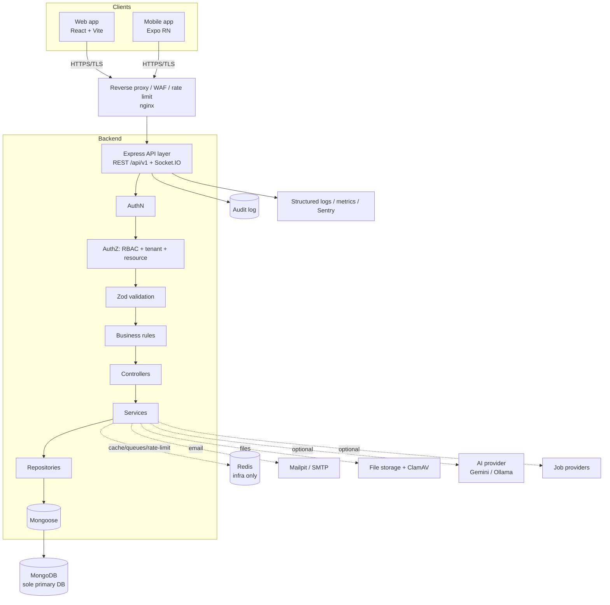

# CampusConnect — Architecture Overview

> **This directory is the single architectural source of truth.** Per the build rules,
> the architecture is *frozen* here at the end of Phase 1. Later phases must not rebuild
> it; if a requirement conflicts with what is written here, the process is: (1) identify
> the conflict, (2) explain the technical impact, (3) propose the smallest safe change,
> (4) never introduce a silent breaking change, (5) proceed only after approval.

## 1. Product in one paragraph

CampusConnect is a multi-tenant "operating system for a modern college campus." It unifies
community, academics, campus operations, communication, student services, career,
recruitment, alumni, security, and AI into one coherent platform serving 14 roles
(student through system admin, plus external recruiters and alumni). It replaces the
fragmentation of notice boards, chat groups, email, and siloed systems.

## 2. Architectural principles (non-negotiable)

1. **Backend is the source of truth.** The frontend is never trusted for authorization.
2. **Authorization is always server-side** and evaluated on every protected request.
3. **Fail closed** — the default answer to an authorization question is "deny."
4. **Tenant isolation is mandatory.** No query may cross an institution boundary.
5. **Least privilege** everywhere (roles, tokens, tool access, DB queries).
6. **Secure by default** — secrets server-side only, safe defaults, defense in depth.
7. **MongoDB is the sole primary database.** No SQL store without approved review.
8. **External providers are replaceable** behind abstractions (AI, jobs, email, storage).
9. **Established cryptography only.** Never invent crypto or security mechanisms.
10. **Local development must work with ₹0 / no paid services.**
11. **APIs are versioned** (`/api/v1`). Backward compatibility is maintained where practical.
12. **Do not over-engineer the MVP;** measure before optimizing.

## 3. System context



## 4. Layered request pipeline

Every protected API request flows through this ordered pipeline. The order is deliberate:
cheap rejections (rate limit, auth) happen before expensive work (DB, business rules).

```text
HTTP request
  → reverse proxy (TLS termination, WAF, coarse rate limit)
  → security headers (Helmet/CSP) + CORS allowlist
  → body size limit + JSON parse
  → request ID + structured logging context
  → rate limiter (per-IP / per-user)
  → authentication (verify access token → identity)
  → tenant resolution (bind institution context)
  → authorization (RBAC role → permission → resource ownership → ABAC condition)
  → input validation (Zod schema for params/query/body)
  → controller (thin: orchestration only)
  → service (business rules, transactions)
  → repository (data access; safe query construction)
  → Mongoose → MongoDB
  → response shaping (consistent envelope) + audit log (for state changes)
```

If any stage denies, the pipeline short-circuits with a consistent error envelope and the
attempt is audit-logged where appropriate. See `docs/security/SECURITY.md`.

## 5. Monorepo rationale

A single npm-workspaces monorepo is used so that **types and validation schemas are shared**
between the server and both clients. This eliminates the classic drift between frontend and
backend contracts: a Zod schema in `packages/validation` is the *one* definition, imported by
the server (to validate) and by the web/mobile forms (to validate + infer TS types). See
`01-tech-stack.md` for why npm workspaces over Nx/Turbo/pnpm at this stage.

## 6. The documents in this directory

| File                          | Contents                                                        |
| ----------------------------- | --------------------------------------------------------------- |
| `00-overview.md`              | This file — principles, context, pipeline.                      |
| `01-tech-stack.md`            | Every technology choice with rationale and rejected options.    |
| `02-folder-structure.md`      | The full annotated monorepo tree.                               |
| `03-backend-architecture.md`  | Layering, module boundaries, error model, transactions.         |
| `04-frontend-architecture.md` | Web app structure, state, routing, data fetching.               |
| `05-mobile-architecture.md`   | Expo RN structure, navigation, secure storage.                  |
| `06-multi-tenancy.md`         | Tenant model, isolation strategy, enforcement.                  |
| `07-adr/`                     | Architecture Decision Records (one file per significant call).  |

Cross-cutting concerns each have a dedicated top-level doc: database (`docs/database`),
API (`docs/api`), security (`docs/security`), deployment (`docs/deployment`), design
system (`packages/ui` + `docs/product/DESIGN_SYSTEM.md`).
